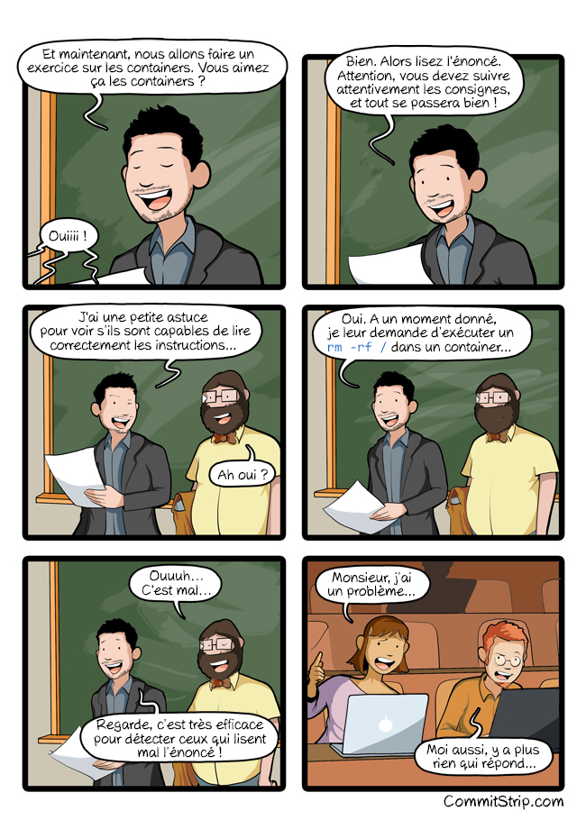

# Docker avancé

## Prérequis

- [Hello Docker](../hello/README.md)

## C'est quoi ?

L'objectif de ce tutoriel est d'aller un peu plus loin dans l'utilisation de `Docker`.

## Environnement

Dans ce tutoriel, on utilisera une machine virtuelle GCP `f1-micro` (1 vCPU, 614 Mo) avec `Debian 10` et Docker installé (cf [Hello Docker](../hello/README.md)).

## Docker ps

La commande `docker ps` donne différentes informations sur les conteneurs en cours d'exécution.

## Docker logs

La commande `docker logs CONTAINDERID` permet d'afficher la sortie standard d'un conteneur en cours d'exécution.

## Docker kill

La commande `docker kill CONTAINERID` permet de tuer un conteneur en cours d'exécution.

## Exercice

- Lancer un conteneur `nginx`
- (optionnel) Faire une requête HTTP vers le serveur
- Obtenir l'identifiant du conteneur
- Afficher les logs du conteneur
- Tuer le conteneur

<details>
  <summary>Solution</summary>
  
  ```shell
  docker run -p 5555:80 nginx  
  curl http://localhost:5555  
  docker ps (l'identifiant correspond à la première colonne : CONTAINER ID)
  docker logs x  
  docker kill x
  ```
</details>

## Mode intéractif

Il est aussi possible d'utiliser le mode intéractif pour intéragir avec le processus d'un conteneur.  
Par exemple, `Ubuntu` publie des images Docker de leur système : [https://hub.docker.com/\_/ubuntu](https://hub.docker.com/_/ubuntu).  
Mais, lancer la commande suivante :

```
docker run ubuntu
```

se révèle tristement décevant. Le conteneur s'arrête aussitôt (d'ailleurs, `docker ps` n'affiche rien après exécution).

Les options `-i` (`interactive`) et `-t` (`tty`) permettent d'intéragir avec le conteneur après son lancement.

```
docker run -it ubuntu
```

Félicitations, vous avez accès à un terminal à l'intérieur d'un conteneur ! Tout ce que vous faites dans ce conteneur n'aura pas d'incidence sur le système hôte (sauf cas particuliers comme les volumes).

Une blague classique consiste à lancer la fameuse commande `rm -rf /` dans le conteneur. Cette commande supprime récursivement TOUS les fichiers depuis la racine du système de fichiers.  
Cette commande revient globalement à suicider le système. Si vous le faites sur le système hôte vous êtes bons pour une réinstallation du système mais, dans un conteneur, il suffit de relancer le conteneur. Petite différence, grosses conséquences :)


_Source : https://commitstrip.com_

## Surcharge de la commande

Le deuxième argument de docker run correspond à la commande à lancer.  
Les images ont, en général, une commande par défaut qu'il est possible de surcharger.  
Par exemple, `docker run ubuntu ls` va lancer, à l'intérieur d'un conteneur `ubuntu`, la commande `ls`.

## Exercice

- Lancer un terminal (`/bin/bash`) dans un conteneur d'image `nginx`
- Lister le contenu (`ls`) du dossier `/usr/share/nginx/html`
- Afficher (`cat`) le contenu du fichier `/usr/share/nginx/html/index.html`

<details>
  <summary>Solution</summary>
  
  ```shell
  docker run -it nginx /bin/bash  
  ls /usr/share/nginx/html 
  cat /usr/share/nginx/html/index.html
  ```
</details>

## Variables d'environnement

Une façon standard de paramétrer un conteneur est de lui passer des paramètres via les variables d'environnement. C'est possible via l'option `-e` (`--env`).

Par exemple, lancer un serveur postgres :

```
docker run postgres
```

aboutit à l'erreur `You must specify POSTGRES_PASSWORD`.

Mais

```
docker run -e POSTGRES_PASSWORD=mdpsecret
```

fonctionne. La variable d'environnement `POSTGRES_PASSWORD` du conteneur sera égale à `mdpsecret`.

## Aller plus loin

Maintenant que le lancement de conteneurs local n'a plus de secrets pour vous, il est temps de voir plus grand et passer à l'orchestration de conteneurs.
